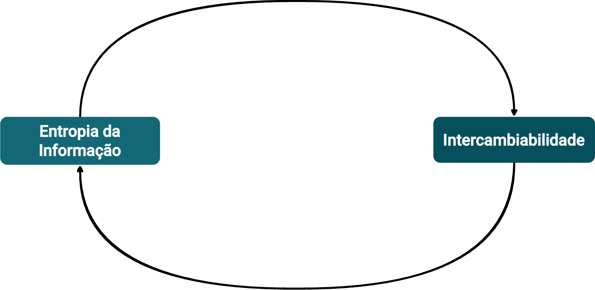

# Chapter 3 — Product Entropy

Every product accumulates information. Part of it is explicit: code, documents, dashboards, runbooks. Part of it is distributed among people, decisions that were never recorded, assumptions that were never questioned, and incidents that were resolved without the root cause ever being made public.

The harder it is to reconstruct the history of a decision or explain the state of a journey, the greater the operational uncertainty. We will call this condition **product information entropy**.

The concept does not need to be treated as a formula. It is an operational condition. And its consequences are practical.

*The relationship between entropy and interchangeability is cyclical: high entropy reduces the organization's capacity to interchange parts of the system safely, and low interchangeability keeps the organization locked to decisions that elevate entropy further. Source: slide 67 of the presentation "ProdOps — Domain Modeling with Reliability, Part 1".*

## How Entropy Manifests

When the organization cannot see clearly, it tends to start more things. Each part of the system creates its own interpretation of what is happening. Different teams make locally correct decisions that, taken together, produce behavior no one anticipated.

Three symptoms indicate high entropy.

The first is **bad signals**: generic or duplicate alerts, without context; dashboards with data that contradict each other; everything classified as maximum priority because no one defined what is actually critical.

The second is **low-confidence decisions**: teams unable to distinguish whether behavior is expected or anomalous; information that does not reach the right person at the right time; absence of traceability between cause and effect.

The third is **noise exceeding signal**: many meaningless logs, alerts that lead to no action, notifications that are ignored because no one believes them anymore.

The result is predictable. The organization compensates for the lack of understanding with execution. More WIP, more meetings, more attempts to manually coordinate what could be predictable if the domain were sufficiently understood.

## The Visualization Principle

There is a direct principle present in the reference material: visualize well to limit WIP.

Visualization is not decoration. It reduces the space for invisible work. When the journey is mapped, dependencies are known, and relevant events are named, the team can distinguish what is urgent from what is merely visible.

This principle connects to a broader claim: adults with good information make better decisions, regardless of seniority level. Seniority does not replace information quality. It merely adds experience in using the available information.

When information is poor, seniority helps less than it should.

## Group Buying: Dependencies That Surface Late

In Group Buying, imagine a failure where some orders remain associated with a group that expired, while the corresponding inventory can no longer fulfill the requested quantity. The group was closed. The orders were not canceled. The customer received a confirmation the system cannot honor.

If the journey was mapped, events were named, and dependencies between domains are known, it is possible to locate at which point coherence was lost. If each application has only its own view, the failure appears as a succession of symptoms without a clear origin.

That is the cost of entropy. Not the failure itself. It is the inability to understand the failure quickly enough to act.

Entropy also appears as invisible dependency. A service can depend on a projection that depends on an asynchronous update that depends on an event that may arrive with delay. Each part can work in isolation. The journey, however, can fail silently.

## The Relationship Between Understanding and Risk

The central consequence is simple: more understanding produces less ambiguity. Less ambiguity produces less useless WIP. Less useless WIP produces fewer hidden decisions. Fewer hidden decisions produces better capacity to model reliability. Better reliability produces lower risk in production.

ODD does not resolve entropy definitively. No approach eliminates the uncertainty of a system that evolves. What ODD seeks is to reduce uncertainty at the moment when it is most manageable — before the domain becomes an engineering commitment.

Once code is in production, retroactive domain discovery is possible, but costly. Organizational incentives rarely support stopping to understand what has already been delivered. ODD proposes that this work happen before.

---

*The organization does not reduce risk merely by executing faster. It reduces risk when it can make the system understandable enough to decide where it is worth placing capacity.*
