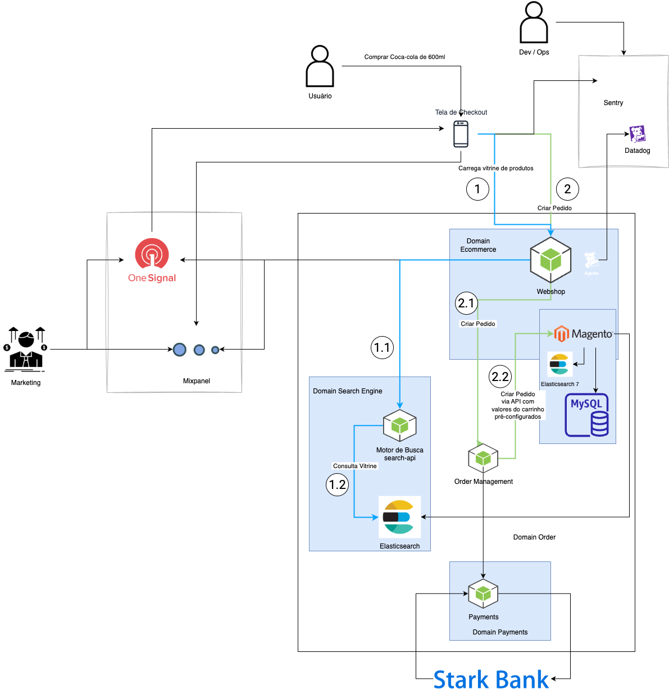

# Chapter 4 — Observability Starts Before Production

There is a late way to observe software: wait for the system to enter production and then decide what to monitor. This approach can produce a lot of data and little understanding.

The problem is not the tools. The problem is that the question that should precede the tool is rarely asked: what, in this journey, needs to remain reliable?

When this question is not answered before production, observability tends to reflect what is technically possible to measure, not what is operationally relevant to observe. The result is an environment with high data density and low capacity to distinguish what is critical from what is merely present.

## The Problem of Metrics Without Context

An infrastructure metric can show that an application is responding within the expected time while a business rule has already stopped being satisfied. A dashboard can indicate that all services are available while an entire journey fails silently because the expected state sequence was interrupted.

This happens because technical availability and experience reliability are different things.

In Group Buying, knowing that the payment service is responding is not sufficient to claim that the group purchase journey is working. We need to know whether orders are being associated with the correct group, whether inventory is reconciled, whether automatic closure is working, and whether notifications are arriving under the right conditions.

Each of those points is a domain concern before it is a technical concern.

## Transactional and Analytical Observability

A distinction present in the reference material is relevant here: transactional observability and analytical observability do not need to be treated with the same tool or in the same plan.

*The diagram illustrates the multiple observability fronts in a real e-commerce product: the user starts at the checkout screen, the journey traverses Domain Ecommerce (Webshop API, Magento, Elasticsearch, MySQL), Domain Search Engine (search-api), and Domain Payments (Stark Bank), while the Marketing analytics channel uses OneSignal and Mixpanel. Dev/Ops monitors with Sentry and Datadog. Each front has its own nature of observation. Source: slide 2 of the presentation "ProdOps — Domain Modeling with Reliability, Part 2".*

The transactional plan is concentrated on the system's immediate operations. Its goal is to facilitate direct and fast response. When a group is closed with a critical error status, the team needs to be alerted immediately.

The analytical plan supports medium and long-term decisions. Conversion rates, abandonment patterns, group formation behavior over time — this information is useful for product evolution, but does not need to be in the same pipeline as operational alerts.

Mixing the two produces unnecessary complexity and, frequently, dulls the capacity to react. When everything is equally observable, nothing is prioritarily observable.

## The Decision About What Deserves to Be Observed

The decision about what deserves to be observed is a domain decision.

It depends on knowing the journey, the events that compose it, the entities that change during the journey, and the dependencies that can compromise the experience. Without this knowledge, the choice of what to monitor tends to be made by technical criteria — what is easier to instrument, what the tool already exposes by default — rather than business criteria.

That is why observability starts before production. Not because dashboards need to be created before launch, but because the question of what to observe needs to be answered while the domain is still being understood.

When this question is answered during domain discovery, observability ceases to be a set of panels added at the end of development. It becomes a direct consequence of what was understood about the journey.

## Three Rules That Guide Operations

The reference material establishes three operational principles that connect directly to this concern.

The first is to put things in production faster — not as an end in itself, but as a way to shorten the feedback cycle between what was built and what the customer experiences. The second is to throw the incident as far away as possible — circuit breakers, retries, failovers; mechanisms that reduce the blast radius of a failure before it affects the experience. The third is to react immediately — actionable alerts, runbooks, war rooms; the capacity to respond quickly depends on observability already knowing what to ask.

All three principles depend on a sufficiently understood domain. It is not possible to throw the incident farther if you do not know which part of the journey is at risk. It is not possible to react immediately if alerts lack enough business context to direct action.

---

*We do not observe because we have a tool. We observe because there is something relevant we decided to continuously understand.*
