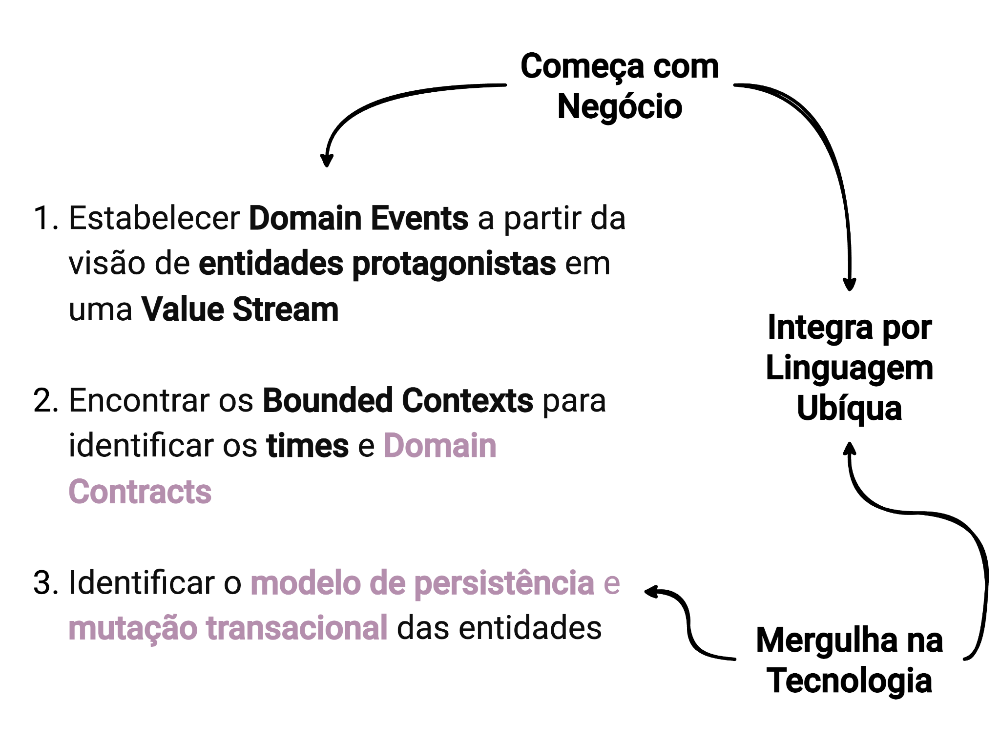

# Chapter 5 — ODD: Observability Driven Design

ODD, Observability Driven Design, is the approach that transforms a product intent into a domain that is understood, observable, and reliable before that intent becomes an engineering commitment.

This definition contains an important boundary. ODD is not a new version of DDD. It is not a catalog of observability tools. It is also not a technique for creating dashboards or an architecture methodology.

## What ODD Is Not

Before defining what ODD does, it is worth making explicit what it does not do — because the most common confusions tend to arise at these boundaries.

**ODD is not DDD.** DDD offers essential foundations for understanding domain complexity: ubiquitous language, Bounded Contexts, aggregates, Domain Events. ODD uses these foundations. The difference lies in the question that guides the work. DDD asks how to model the domain. ODD asks what we need to understand about the domain to know what needs to be observed, operated, and protected before commitment.

**ODD is not Runtime observability.** Tools like Datadog, Dynatrace, and Grafana are important for operating products in production. ODD does not replace or compete with these tools. The difference lies in timing. ODD operates before production, in the domain discovery and understanding phase. What ODD produces guides how Runtime observability will be configured — but it is not the configuration itself.

**ODD is not architecture.** The result of ODD is not a microservices diagram, a database decision, or an integration map. These elements may emerge as a consequence of ODD work, but they are not its direct objective.

## The Question That Differentiates ODD

The question that defines ODD is:

> **What do we need to understand about the domain to know what needs to be observed, operated, and protected before committing to build?**

This question changes the purpose of modeling. The expected result is not just a conceptual model. It is the preparation of conditions for decision.

When ODD is being applied, journey, Value Stream, Domain Events, protagonist entities, mutability, Bounded Contexts, teams, contracts, and reliability form a sequence. Each discovered element advances the understanding of the domain to the point where the organization can say: we understand enough to make a commitment.

## ODD's Position

In the ProdOps universe, ODD occupies a precise position:

```
Intent → ODD → OBC → PRE → Delivery → Runtime → Outcome
```

ODD works between Intent and OBC. During this interval, the domain is being discovered. There are experiments, hypotheses, conversations, and revisions. Flexibility is desirable because we are still learning.

OBC marks the passage point: the domain is sufficiently understood for the organization to make a commitment. From there, PRE begins, which prepares the execution of what was committed.

This distinction protects ODD against two opposite deviations. The first is turning it into an architecture activity — as if the result of ODD were a set of technical decisions. The second is turning it into an operational activity — as if ODD were about monitoring what is already in production.

ODD comes before both. It seeks to produce enough understanding so that architecture, delivery, and operations are informed decisions, not attempts to compensate for what was not understood.

## ODD's Conceptual Structure

The starting point is always the business. From there, ODD follows three steps toward technology, integrating everything through the domain's ubiquitous language.



*The three structural steps of ODD: (1) establish Domain Events from the view of protagonist entities in a Value Stream; (2) find the Bounded Contexts to identify the teams and Domain Contracts; (3) identify the persistence model and transactional mutation of the entities. The cycle integrates by Ubiquitous Language and dives into Technology only after the domain is sufficiently understood. Source: slide 19 of the presentation "ProdOps — Domain Modeling with Reliability, Part 2".*

## The Four Movements

ODD organizes itself in four sequential movements.

The first is **seeing** — before modeling, it is necessary to understand the product's trajectory through journey, Value Stream, Service Blueprint, and Product Deck.

The second is **making the domain explicit** — discovering the relevant events, identifying the entities that play them out, establishing semantic boundaries and responsibilities.

The third is **discovering where risk really is** — understanding how entities change and what the operational consequence of each change is.

The fourth is **transforming the domain into a Reliability Plan** — the result of ODD is not a diagram. It is a plan the organization can use to decide.

The following chapters walk through each of these movements in detail, using the Group Buying case as the narrative thread.

---

*ODD's contribution is not in replacing existing practices, but in changing the question that precedes commitment: before building, what do we need to understand to know where reliability really is?*
