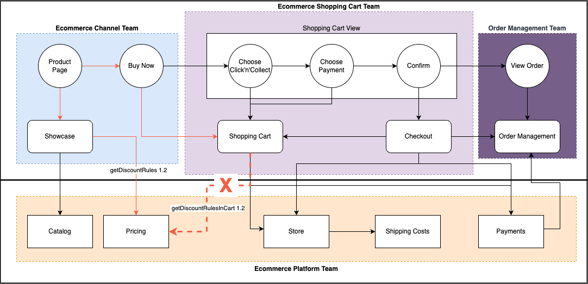

# Chapter 6 — Start with the Journey

The first movement of ODD is seeing.

This seems obvious until you notice that most organizations start with something else. They start with a service that needs to be created, an API that needs to be defined, a feature that came up in a planning meeting. They start with what is technically tangible — not with what is operationally relevant.

An organization can know its applications and still not know its journey. It can know its teams and still not know where the customer loses value. It can know its integrations and still not know which dependency threatens an experience.

That is why the initial unit of understanding in ODD is the product's trajectory.

## What Seeing Means

Seeing, in the context of ODD, is not drawing. It is asking the questions in the right order.

How does a person arrive at the product? Which touchpoints do they traverse? Where is there a decision? Where is there waiting? Where is there a risk of loss? Which alternative flows exist, and which are the cases where the journey fails?

Journey, Value Stream, and Service Blueprint serve complementary functions in this discovery. They allow connecting intent, flow, touchpoints, services, and parts without starting from implementation.

*The Service Blueprint organizes the journey into layers: customer actions at touchpoints (Product Page, Buy Now, Shopping Cart View, View Order), the teams responsible for each part (Channel Team, Shopping Cart Team, Order Management Team), and the services sustaining each stage (Catalog, Pricing, Store, Shipping Costs, Payments). The failure mark at `getDiscountRulesInCart 1.2` shows exactly the kind of invisible dependency that a well-done blueprint makes visible before the incident. Source: slide 21 of the presentation "ProdOps — Domain Modeling with Reliability, Part 1".*

The Product Deck organizes what was discovered from the four dimensions of the product: Customer, Company, Team, and Technology. Its function is not to produce a report. It is to be an index for fast decision-making, integrating the views that usually exist separately — the business view, the operations view, the team view, and the technical view.

## Group Buying: The Journey That Reveals the Domain

In the Group Buying case, the question that initiates the work is not which endpoint creates a group. The question is: how does a person arrive at the group purchase?

The answer reveals a sequence that needs to be coherent from end to end.

There is a product that needs to be available in the catalog, enriched with content, price, and inventory. That product needs to be eligible for group purchase. When a buyer decides to start a group, an offer is created, the group is announced, and it begins to be indexed so others can find it in related searches.

Other buyers find the group, join, have carts created and invoices generated. The group has a deadline. If the minimum volume is not reached before the deadline, the group closes with a different status than it would if the volume had been reached.

Each of those moments is a touchpoint — a place where something significant happens between the business and the customer. Each touchpoint can be the place where the experience is preserved or where it breaks.

## Why Four Dimensions

The journey alone risks being reduced to the customer's perspective. ODD needs a broader view because reliability does not depend only on how the customer experiences the product.

The **Flow** dimension shows the movement of the journey — where the product advances, where it stops, where it fails. The **Team** dimension shows who holds capacity and responsibility in each part of the journey. The **Data** dimension shows what changes and what that behavior means for the business. The **Parts** dimension shows the applications and dependencies that sustain the trajectory.

These four dimensions together make visible what usually remains invisible: the dependencies between teams, the gaps between responsibilities, the points where information arrives too late to be useful.

## The Journey Is Not the Final Product

Seeing is not the destination. It is the beginning.

After mapping the journey, questions arise that did not exist before: where does a relevant change occur? Who plays out that change? Which data changes? Which dependency participates? What consequence appears if the change fails?

Without the journey, these questions are asked about isolated parts and rarely receive complete answers. With the journey, they are asked about the product as a system — and the answers begin to reveal where reliability needs to exist.

---

*Before asking how to build a part, discover which trajectory it participates in. It is the journey that gives meaning to the parts.*
