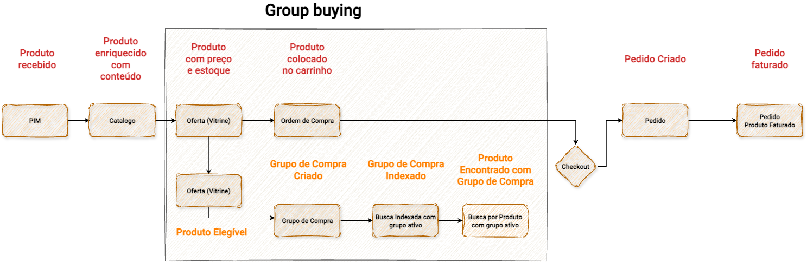

# Chapter 7: Events Tell the Story

A journey can be drawn as a sequence of activities. The domain, however, becomes clearer when we can identify relevant events.

There is an important difference between an activity and an event. An activity describes what someone does, the user clicks, the system processes, the team approves. An event describes what has already happened, a group was created, an order was received, a charge was billed, a product was delivered.

Events tell the story because they record changes that have already become true. They are the vocabulary of the domain in motion.

## Why Events Reveal More Than Activities

A screen shows a representation of the current state. An event shows the change that made that state possible.

This difference changes what we can ask. From a screen, we can ask how it is organized or what it displays. From an event, we can ask what happened for it to exist, which entities were affected, which other events may follow it, and what fails when it does not occur at the right time.

The language shift is decisive. When a team can describe the domain as a sequence of events, not just as a set of screens, fields, and buttons, the conversation between business and technology reaches another level of precision.

## Event Storming as a Discovery Instrument

Event Storming is a structured way to discover events from business behavior. Its value is not in the sticky notes, the room, or the tool. It is in the conversation that makes explicit the sequence of events and the conditions that make them possible.

An Event Storming session starts with events, what happened, and works backward to discover what caused them. Commands, actors, external systems, policies, and constraints appear as consequences of this investigation.

The result is a domain narrative that anyone involved in the product can read and question, including people who do not write code.

Event Storming, therefore, does not conclude the modeling. It opens the way for subsequent questions about protagonists, boundaries, and reliability. A mistake would be to finish the work when the mapping is complete. Events matter because they help us discover domain, responsibility, and what needs to be observed.

## Group Buying: Events That Build the Journey

In Group Buying, the question is not just which screens exist. We ask what happened for the current state to exist.

Group created. Group announced. Group indexed for searches. User joined the group. Cart created. Invoice generated. Order created. Deadline expired with insufficient quantity. Group closed with pending commercial approval. Product received.

*The diagram shows Group Buying Domain Events as a sequence of occurrences: the main journey goes from PIM to Billed Order, while the Group Buying subflow reveals the events of Eligible Product, Buying Group Created, Buying Group Indexed, and Product Found with Buying Group. Each orange box is an event, not an activity. Source: slide 71 of the presentation "ProdOps — Domain Modeling with Reliability, Part 1".*

Each of these events represents a change that matters to the business. Each can have direct consequences in other domains: the indexing event needs to propagate to the search engine, the closure event needs to notify the commercial team, the receipt event may need to update delivery metrics.

Domain events also have precise names. In the Group Buying case, events like `group_buying.shopcart.buybox.added` with metadata `{group:created}` or `{group:adhesion}` reveal not just what happened, but in which context it happened. This semantic precision is what allows distinct systems to coordinate without excessive coupling.

## What Events Reveal About Protagonists

From events, we begin to perceive which elements actually move the journey.

Some data changes constantly and drives the flow. A buying group changes state several times during its lifecycle. An order changes as it advances through the billing process. A cart changes whenever the buyer interacts with it.

Other data participates in the journey as supporting information. A product exists and is referenced, but rarely changes during a specific purchase. An offer is consulted, but not altered by the act of purchasing.

This distinction, between what changes and what merely exists, prepares the discovery of protagonists. And it is about protagonists that the next chapter deals.

---

*Events are not the final product of discovery. They are the narrative that allows us to see what changes and, from that, discover where reliability needs to exist.*
