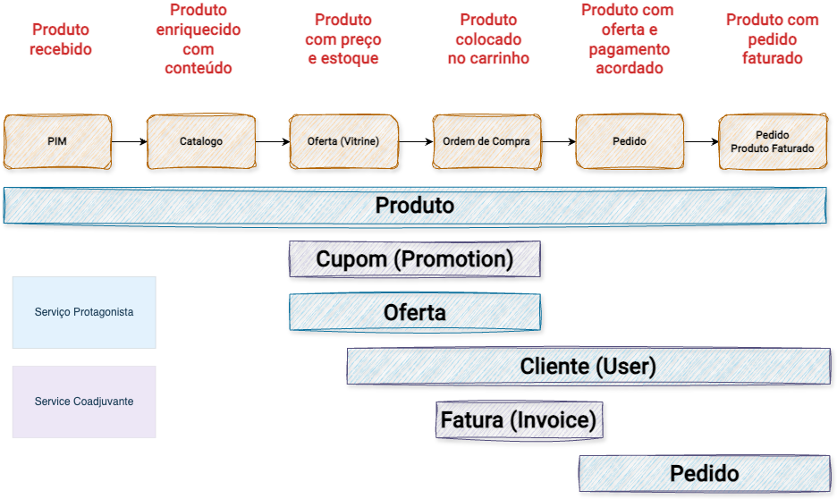

# Chapter 8: Find the Protagonists

Not all data carries the same weight in a journey.

There is a distinction the reference material formulates directly: protagonist entities and data are the central elements that move the journey of a process. They change state over time, influence decisions, determine rules, and drive the flow. These are the data that deserve special attention, because their mutation impacts the behavior and outcome of the system as a whole.

Supporting data exists and participates in the journey, but generally affects without interrupting. When a supporting piece of data is incorrect, the effect tends to be visible in the presentation or in the information displayed. When a protagonist piece of data is incorrect or inconsistent, the effect tends to be felt across the entire journey.

## Why the Distinction Matters

Treating all data with the same level of attention is a way of not paying particular attention to anything.

A product table and an order table do not carry the same operational risk in a purchase journey. A configuration object and a buying group object do not have the same frequency of change nor the same consequence when they are inconsistent.

The distinction between protagonists and supporting elements allows abandoning the view in which all tables, APIs, and objects receive the same architectural treatment and the same level of operational rigor. When we know who drives the journey, we know where to concentrate attention.

This also changes the conversation about observability. It is not possible to observe everything with the same rigor without the signal getting lost in noise. Protagonists need observability proportional to their role.

## Group Buying: Who Moves the Journey

In the Group Buying case, protagonists reveal themselves when we look at what changes and what that change means for the flow.

The **buying group** is the central protagonist. It starts as a nonexistent state, is created, announced, indexed. Participants enter, orders are associated, the deadline advances. In the end, the group closes, whether successfully, with pending commercial approval, or with a critical persistence error. Each state transition is relevant and can have consequences in other domains.

The **order** is also a protagonist. It is born associated with a group and a cart, passes through the billing process, and ends as a billed order, an object that represents a financial commitment from the business to the customer.

The **cart** is a protagonist of a shorter and more volatile cycle. It exists while the buyer is in the process of joining and disappears, as an active transactional object, when the order is confirmed.

By contrast, the **product** is primarily a supporting character in this journey. It is referenced, consulted, and displayed, but rarely changes as a result of a specific group purchase. The **catalog** and the **offer** are also supporting characters, important for the journey to begin, but not altered by the process itself.

*The diagram maps each entity across the full Value Stream (PIM → Catalog → Offer Showcase → Purchase Order → Order → Billed Order). The horizontal bars show at which stages each entity is a protagonist (more intense solid line) or a supporting character (dashed line). Product spans the entire journey as a supporting character; Order enters only in the final stages, but as an absolute protagonist. Source: slide 28 of the presentation "ProdOps — Domain Modeling with Reliability, Part 1".*

## Protagonism Depends on the Point of Observation

An important nuance: protagonism is not an absolute property of an entity. It is relative to the Value Stream being observed.

In a group purchase journey, the product is a supporting character. In a catalog registration or price update journey, the product is the protagonist. The same entity can change roles depending on the flow being analyzed.

This is relevant for ODD because it means that the discovery of protagonists needs to happen in relation to a specific journey, not in the abstract. When the journey is not clear, the identification of protagonists tends to be done by intuition or perceived importance, which generally favors the most familiar data, not the most critical.

## From Discovery to Responsibility

Identifying a protagonist immediately raises a series of questions that need answers: where is this entity controlled? Who answers for the changes it undergoes? Which contracts exist around it that guarantee other systems can depend on its state?

These questions connect protagonists to Bounded Contexts, the topic of the next chapter.

---

*The domain begins to become intelligible when we stop treating all data as equivalent and start seeing those that actually drive the journey.*
