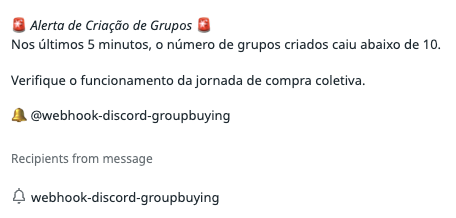

# Chapter 11: The Domain Contract

An isolated technical contract can say how to call a service, the endpoint, the HTTP method, the payload schema, the expected response codes. A domain contract needs to say, even if indirectly, what that interaction means for the product.

This distinction is not semantic. It determines what is testable, what is monitorable, and what is negotiable when the journey fails.

ODD arrives at contracts after journey, events, protagonists, and boundaries. This order matters. The contract is not the beginning of discovery, it is a consequence of it.

## What a Domain Contract Needs to Express

A domain contract needs to go beyond the technical signature.

It needs to express which business conditions are preserved by the interaction. When an order is created, which invariants need to be true? The group needs to be active. The buyer needs to have a valid cart. The invoice needs to be generated. If any of these conditions is not satisfied, the contract was violated, regardless of whether the endpoint responded 200.

It needs to express which availability and consistency guarantees are offered. A dependency that offers eventual consistency cannot be treated as if it offered immediate consistency. A service that can be unavailable for short periods cannot occupy a critical path without a fallback mechanism.

It needs to express what happens when the interaction fails. Silent failure, failure with automatic retry, failure with immediate notification, each choice has operational consequences that need to be made explicit before they become surprises in production.

## SLA, SLO, SLI, and Error Budget as Internal Contracts

The reference material treats SLA, SLO, SLI, and Error Budget as evolutionary contracts, not merely as external commitments to customers, but as internal agreements between teams.

The SLO defines the reliability objective of a service within a period. The SLI measures what is being observed to verify whether the SLO is being met. The Error Budget is the space of tolerated failure before the SLO is violated. And the SLA is the formal commitment, frequently derived from the SLO, with external parties.

This structure brings reliability closer to experience. A team should not only measure what its application can measure internally. It should measure what allows understanding whether its responsibility is preserving the journey.

In Group Buying, this means that the SLO of a buying group service should not merely be "99% of requests respond in less than 200ms." It should include something like "zero critical failures in the automatic group closure process", a condition that only makes sense if the journey was understood.

## Group Buying: Contracts That Protect the Journey

In Group Buying, an order creation contract is not just a POST that responds 201. It is a promise about what it means to receive an order and which conditions need to be preserved, active group, valid cart, available inventory, generated invoice.

An integration with the search engine is not just an indexing call. It is a contract that says: when a group changes state, the indexed representation needs to be updated within an acceptable time. If the contract is broken, buyers may find expired groups in searches.

An integration with the commercial team is not just a notification. It is a contract that says: when a group closes with pending approval, a person needs to be informed in time to make a useful decision.

*The alert shows a domain contract in action: "In the last 5 minutes, the number of groups created fell below 10. Check the functioning of the group purchase journey." This is not a technical infrastructure alert — it is a business behavior alert. It can only exist if the journey was understood and the contract was made explicit: how many groups should be created in five minutes is a domain condition, not a server metric. Source: slide 22 of the presentation "ProdOps — Domain Modeling with Reliability, Part 2".*

## What This Chapter Is Not

This chapter is not a catalog of integration patterns. ODD does not prescribe a technology for all contracts.

Some contracts will be expressed as synchronous APIs. Others as asynchronous events. Others as shared states with consistency guarantees. The choice depends on the discovered behavior, the mutation frequency of the involved entity, and the level of tolerance for deviation the business accepts.

What matters is making explicit the relationship between domain behavior and reliability condition, before that relationship is discovered in production, in the worst possible way.

---

*A technical contract without business context is just a specification. The contract gains strength when we can explain which part of the journey it protects.*
