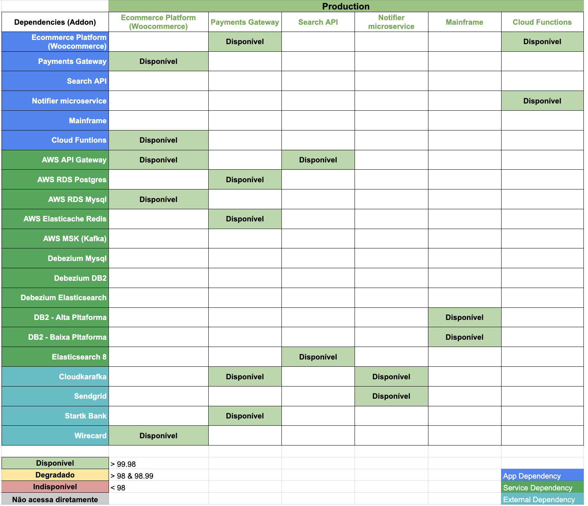

# Chapter 13 — The Reliability Matrix

After discovering journey, protagonists, boundaries, and contracts, there is still one operational question left to answer: where can reliability be lost?

The Reliability Matrix organizes this question in a visual and actionable way.

In the reference material, it crosses applications and their dependencies. Each intersection — each node in this matrix — functions as a reliability KPI directly connected to the customer experience. The goal is to produce observation points that are measurable, observable, and actionable.

## A Dependency Is Not Just an Arrow

In architecture diagrams, dependencies usually appear as arrows — lines connecting boxes, indicating that one system calls another. This representation is useful for understanding structure, but not sufficient for understanding risk.

A dependency in the Reliability Matrix is not just an arrow. It is a condition that can protect or threaten the journey.

When the payment service is a dependency in the critical path of order creation, each intersection needs to answer a concrete question: what happens to the group purchase journey if this service is unavailable? The answer is a KPI — or a set of KPIs — that needs to be monitored.

## What Goes Into the Matrix

The matrix connects the applications involved in the journey with their direct dependencies. For each relevant intersection, instrumentation needs to cover what matters for the experience — not just what is technically easy to measure.

Metrics like availability, error rate, and latency can participate in this matrix when they make sense for the observed point. SLOs can be used to establish explicit reliability conditions — when the success rate drops below a certain level, the Error Budget is being consumed and a decision needs to be made.

The reference material is precise on this point: the matrix becomes useful for business and product when each node has operational meaning — not just technical meaning. Engineering observes technical behavior. Product observes the impact on experience. Operations alerts the correct team to reduce MTTR.

This creates a common language. All nodes and edges can generate incidents — and each incident has an explicit owner, not just a suspected system.

## Group Buying: What the Matrix Reveals

In Group Buying, the journey traverses multiple domains. The Reliability Matrix makes visible what each dependency means for the experience.

*The matrix shows all product applications in the columns and all dependencies in the rows. Each intersection marked "Disponível" (Available) represents a monitorable KPI. The color legend defines three states: Available (>99.98%), Degraded (>98% and <98.99%), and Unavailable (<98%). The infrastructure rows (AWS API Gateway, RDS, Elasticsearch, Kafka, Debezium, DB2, Sendgrid, Stark Bank, Wirecard) are grouped by dependency type: App Dependency, Service Dependency, and External Dependency. Each filled cell is an observation point that needs an owner. Source: slide 37 of the presentation "ProdOps — Domain Modeling with Reliability, Part 1".*

It is not enough to know that the payment service is available. We need to know what its unavailability means for the group purchase journey and who needs to act. It is not enough to know that inventory responds. We need to know whether the relevant states — reserved quantity, available quantity, quantity committed by the group — remain reconciled between the domains that consult them.

The integration between the group domain and the search engine is a dependency with an implicit contract — when a group changes state, indexing needs to reflect that within an acceptable time. The Reliability Matrix makes this contract explicit as a KPI: what is the maximum tolerable latency between a group change event and the index update? When this time is exceeded, who needs to know?

## Alerting as a Consequence of the Matrix

One of the most practical uses of the Reliability Matrix is guiding the alerting of specific teams during an incident.

Troubleshooting an integration problem does not need to gather all the teams involved in the product. It needs to gather the teams with the capacity to act at that specific intersection — the owners of the Bounded Contexts that participate in the problematic node.

The matrix maps these responsibilities before the incident. When the failure happens, alerting is guided by knowledge already documented about who controls each dependency — not by an improvised investigation under pressure.

---

*The Reliability Matrix transforms architecture into a decision surface. Each dependency begins to answer the question: what needs to remain reliable here for the experience to keep working?*
