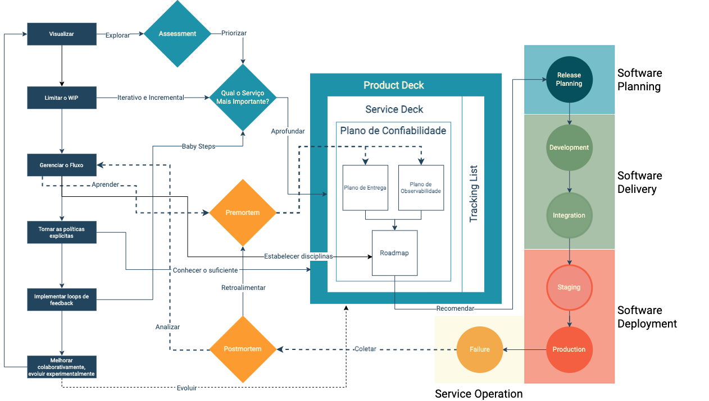

# Capítulo 1: Construímos antes de compreender

Uma organização raramente começa um produto dizendo que deseja construir um sistema confuso. Ela começa com uma intenção legítima. Existe uma oportunidade comercial, uma necessidade de cliente, uma mudança operacional ou uma decisão estratégica. O problema surge quando essa intenção atravessa diretamente para o backlog e o backlog passa a ser tratado como se fosse compreensão.

É possível ter centenas de cards e ainda não saber como o produto realmente funciona. É possível ter uma arquitetura sofisticada e não saber quais acontecimentos são críticos para a jornada. É possível ter ferramentas de observabilidade instaladas e ainda não saber o que deveria ser observado.

Essa distância entre intenção e compreensão é o problema central que este livro procura endereçar.

## A pressão que encurta o entendimento

A dinâmica que leva organizações a construir antes de compreender não é descuido. É pressão. Prazos, competição, expectativas de stakeholders e o custo visível do tempo de descoberta criam uma gravitação constante em direção à execução.

O raciocínio é direto: quanto antes começarmos a construir, mais cedo entregaremos valor. O problema é que esse raciocínio esconde uma premissa silenciosa, que sabemos o suficiente para construir aquilo que será, de fato, valioso.

Quando a premissa é verdadeira, a pressão pela execução faz sentido. Quando ela é falsa, a pressão produz retrabalho, dependências invisíveis e produtos difíceis de operar.

A questão não é velocidade. É a qualidade do entendimento que precede a velocidade.

## O que acontece quando o backlog substitui a compreensão

Existe uma forma de confusão particularmente custosa: a confusão bem documentada. Cards detalhados, critérios de aceite extensos, estimativas precisas, tudo isso pode coexistir com um entendimento insuficiente do domínio.

A consequência aparece depois. Um serviço é construído sobre uma suposição que ninguém registrou como suposição. Uma dependência cresce sem que ninguém tenha mapeado o que acontece quando ela falha. Um fluxo que parecia simples revela, em produção, uma sequência de estados que ninguém havia descoberto durante o desenvolvimento.

O trabalho de descoberta do domínio existe justamente para reduzir essa distância, não porque a descoberta seja mais valiosa que a entrega, mas porque entrega construída sobre entendimento insuficiente tende a custar mais do que a descoberta que foi evitada.

## Group Buying: quando a intenção parece simples

No caso de Group Buying, a intenção parece simples: permitir que pessoas participem de uma compra em grupo para aproveitar descontos progressivos baseados em volume. A descrição cabe em uma frase.

Mas a simplicidade desaparece quando perguntamos o que precisa acontecer para que essa promessa seja verdadeira.

Existe uma oferta que precisa ser elegível. Existe um grupo que precisa ser criado, anunciado e indexado para que outros possam encontrá-lo. Existem participantes que aderem, carrinhos que são criados, invoices que são geradas. Existe um prazo. Existe um volume mínimo que, se não for atingido, muda o destino do grupo. Existe uma sequência de estados, criado, ativo, indexado, aderido, expirado, encerrado, que precisa permanecer coerente entre domínios distintos.

O primeiro erro seria começar pelos serviços. O segundo seria começar pelo banco de dados. O terceiro seria começar pelas APIs. Todos esses começos têm em comum o fato de serem começos técnicos diante de um problema de domínio ainda não compreendido.

## A pergunta que orienta o livro

ODD nasce nesse espaço. Não como uma técnica para escrever código melhor, mas como uma forma de transformar intenção em entendimento suficiente para que a organização saiba o que está prestes a comprometer.

A pergunta que orienta este livro é anterior à escolha de qualquer tecnologia: antes de construir o produto, o que precisamos compreender para saber o que deverá ser observado, operado e protegido?

Essa pergunta muda a natureza do trabalho de descoberta. Ela não existe para atrasar a entrega. Existe para que a entrega aconteça sobre um terreno suficientemente conhecido.

*O ciclo ProdOps mostra onde o trabalho de compreensão se encaixa: antes do release, não depois. O Plano de Confiabilidade, produzido durante a fase de Pre-work e Premortem, alimenta diretamente o ciclo de Release, Planning e Refinamento. Fonte: slide 8 da apresentação "ProdOps — Modelagem de Domínio com Confiabilidade, Parte 1".*

---

*Compreender não é atrasar a entrega. É diminuir a quantidade de execução feita sobre uma realidade que ainda não foi entendida.*
