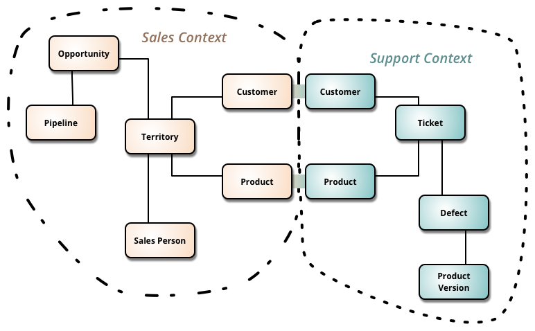
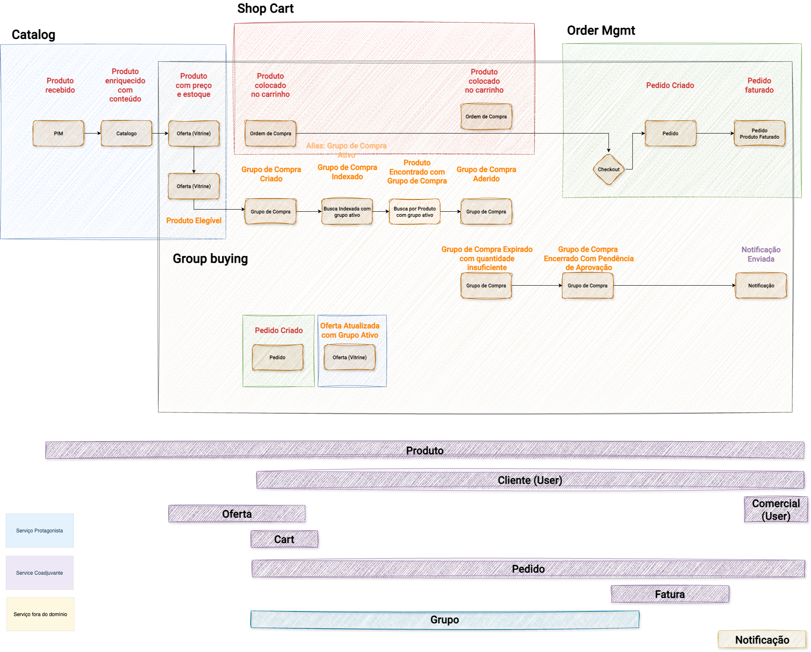

# Capítulo 9: Onde termina um domínio?

Descobrir protagonistas não basta. Precisamos descobrir onde cada significado permanece válido.

Uma entidade pode ter sentidos diferentes em partes distintas da organização. O conceito de "produto" para o time de catálogo não é o mesmo que para o time de pedidos. O "produto" do catálogo é um conjunto de atributos, categorias e conteúdo editorial. O "produto" de um pedido é um item com preço, quantidade e condição de entrega. Ambos compartilham um identificador, mas possuem comportamentos, regras e responsáveis distintos.

Quando essa diferença não é explicitada, os sistemas começam a compartilhar suposições que nunca foram acordadas. As consequências aparecem na forma de bugs difíceis de localizar, decisões de design que violam regras de outro time sem que ninguém perceba e mudanças que produzem efeitos colaterais inesperados em contextos que ninguém havia mapeado.

## Bounded Context como fronteira de responsabilidade

Bounded Context, conceito central do Domain-Driven Design, oferece uma forma de estabelecer fronteiras semânticas. Dentro de um Bounded Context, um modelo de domínio possui significado, regras e consistência próprios. Fora dele, o mesmo termo pode significar outra coisa.

*O exemplo clássico mostra como Customer e Product existem tanto no Sales Context (com Opportunity, Pipeline, Territory, Sales Person) quanto no Support Context (com Ticket, Defect, Product Version). São entidades com o mesmo nome e identificador, mas com comportamentos, regras e responsáveis completamente distintos em cada contexto. A linha de separação entre os contextos é a fronteira semântica. Fonte: slide 19 da apresentação "ProdOps — Modelagem de Domínio com Confiabilidade, Parte 1".*

ODD utiliza esse fundamento porque confiabilidade também depende de saber quem possui uma verdade e onde ela pode ser alterada.

A fronteira não deve ser escolhida apenas porque uma aplicação parece grande ou porque um serviço parece conveniente. Ela deve surgir da compreensão do domínio, da responsabilidade e dos contratos necessários para que a jornada continue funcionando.

Sem responsabilidade associada, um Bounded Context é apenas uma caixa no diagrama.

## Como os contextos se relacionam

Quando existem múltiplos Bounded Contexts, suas relações precisam ser explicitadas. DDD descreve padrões de relacionamento que ajudam a entender como os contextos cooperam, competem ou se isolam.

Uma relação de **Customer/Supplier** existe quando um contexto depende do outro com contratos bem definidos, o consumidor adapta seu modelo ao que o fornecedor expõe. Uma **Anti-Corruption Layer** existe quando um contexto precisa isolar seu modelo da influência de outro contexto externo, ele traduz, sem se contaminar. **Separate Ways** significa que os contextos operam de forma completamente independente.

Cada padrão tem implicações para o design, para os times e para a confiabilidade. Uma dependência direta entre contextos sem contrato explícito é uma dependência invisível, exatamente o tipo de dependência que ODD procura tornar visível.

## Group Buying: fronteiras que emergem da jornada

No Group Buying, diferentes partes da jornada possuem responsabilidades claramente distintas.

O domínio de **catálogo** responde pela existência e pelos atributos do produto. O domínio de **oferta** responde pela elegibilidade e pelas condições da compra em grupo. O domínio de **grupo** responde pelo ciclo de vida do grupo, sua criação, adesões, expiração e encerramento. O domínio de **pedido** responde pela transação financeira. O domínio de **busca** responde pela indexação e pela descoberta.

Cada um desses domínios possui sua própria linguagem, suas próprias regras e seus próprios protagonistas. Quando uma mudança no grupo precisa se propagar para o motor de busca, para que o grupo indexado reflita o estado atual, existe uma dependência entre domínios que precisa ser gerenciada como um contrato, não como uma implementação improvisada.

*O Context Map do Group Buying torna visível a divisão de responsabilidades entre contextos: Catalog (azul, esquerda) cuida do produto enriquecido e da oferta; Shop Cart (vermelho) controla o fluxo do carrinho e a criação de pedidos; Group Buying (centro branco) gerencia o ciclo de vida do grupo, a indexação e o encerramento; Order Mgmt (verde, direita) cuida do pedido e do faturamento. Cada contexto tem protagonistas próprios e os contratos entre eles são dependências explícitas. Fonte: slide 74 da apresentação "ProdOps — Modelagem de Domínio com Confiabilidade, Parte 1".*

## Especialistas de domínio como guardiões do significado

A descoberta de Bounded Contexts depende de pessoas que conhecem profundamente cada parte do negócio, especialistas de domínio, ou Subject Matter Experts.

São eles que sabem onde uma palavra muda de significado. São eles que percebem quando uma regra de negócio está sendo violada por uma decisão técnica que parecia neutra. São eles que conseguem dizer, com autoridade, o que pode mudar dentro de um contexto sem afetar os outros.

ODD não funciona sem esse diálogo. A descoberta de fronteiras semânticas é, fundamentalmente, uma conversa entre quem entende o negócio e quem vai construir o sistema.

## Da fronteira ao contrato

Quando uma fronteira de domínio é estabelecida, a pergunta seguinte é natural: como os contextos se comunicam? O que um contexto pode esperar do outro? Em que condições essa expectativa é válida?

Essas são as perguntas sobre contratos de domínio, o tema do Capítulo 11. Antes de chegar lá, precisamos entender o que diferencia entidades em termos de risco, porque é a natureza da mudança que determina o que o contrato precisa proteger.

---

*Bounded Contexts não são o ponto final da modelagem. São uma consequência da tentativa de tornar responsabilidade, linguagem e confiabilidade suficientemente explícitas.*
