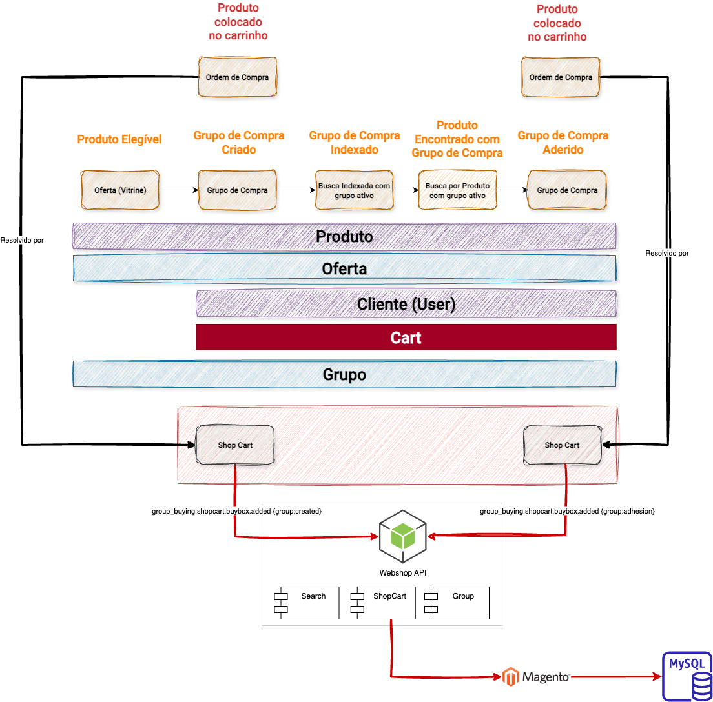
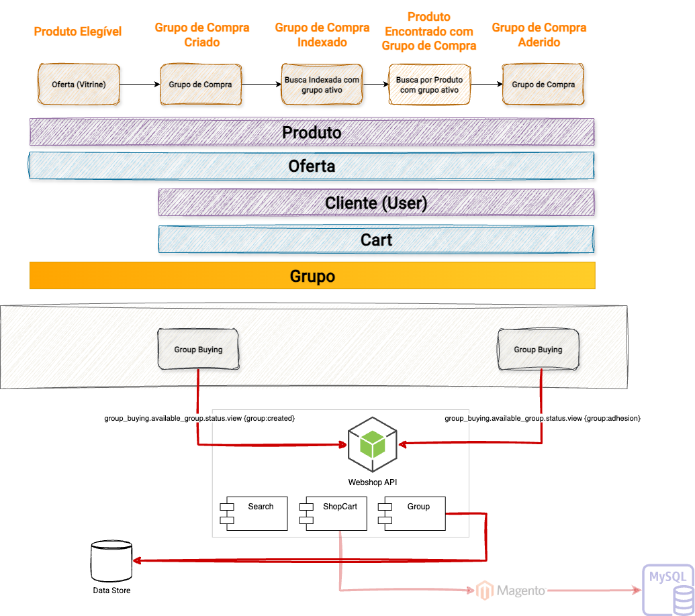
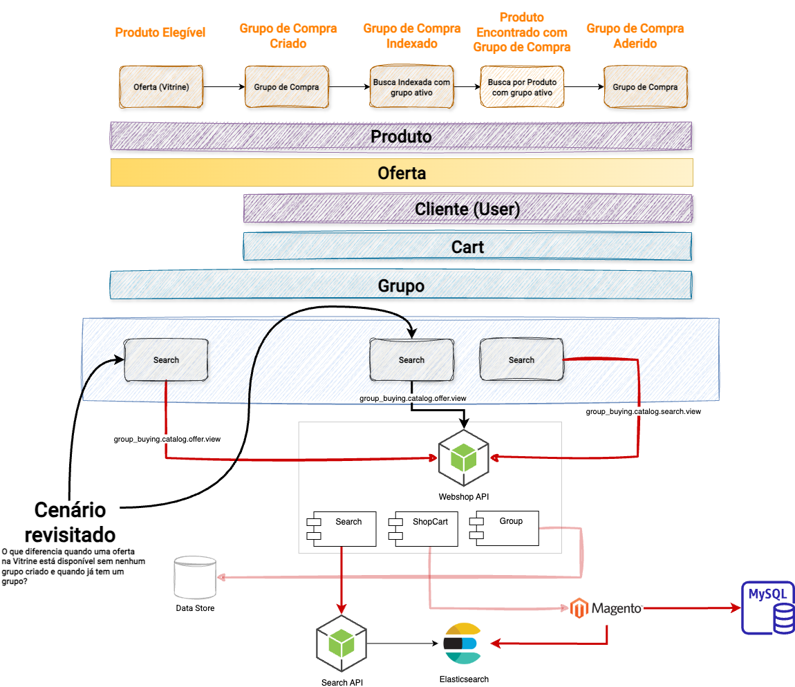
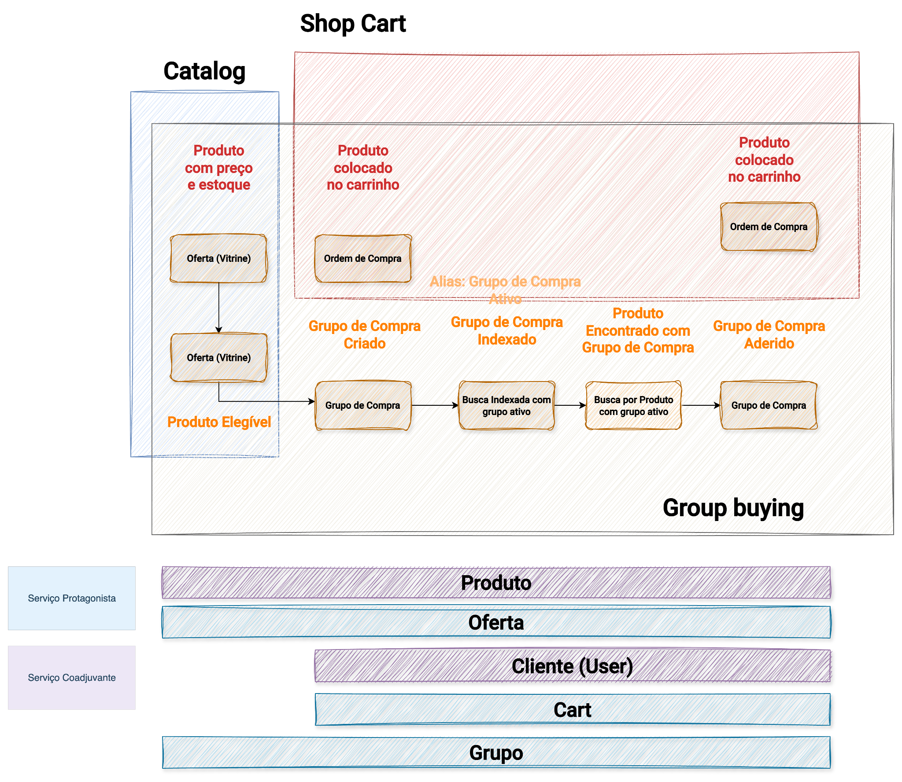

# Capítulo 10 — Mutabilidade é risco

Se uma entidade muda, precisamos compreender como ela muda. Se ela muda frequentemente, a necessidade de observação aumenta. Se ela muda em um contexto de baixa tolerância ao desvio, a necessidade de consistência aumenta também.

Frequência de mutação e tolerância ao erro são as duas dimensões que determinam o risco de uma entidade em uma jornada. A pergunta não é se a entidade é importante, mas como ela se comporta quando sofre mudança e o que acontece quando essa mudança falha.

O material de referência organiza entidades em quatro categorias. Cada categoria carrega consequências diretas sobre onde concentrar a observabilidade, que estratégia de persistência faz sentido e como estruturar os alertas. O Group Buying serve como o caso contínuo para tornar cada categoria concreta.

## Entidades Voláteis: o Cart

Entidades voláteis apresentam mutabilidade muito alta. Elas mudam a cada interação do usuário, muitas vezes dentro de uma única sessão, sem que cada mudança precise ser permanente.

O carrinho de compras é o exemplo canônico. Itens são adicionados, removidos, quantidades alteradas, grupos associados e sessões expiradas, tudo isso sem que o comprador tenha finalizado nada. O carrinho reflete a intenção do momento, não uma decisão consolidada.

No Group Buying, o Cart carrega uma camada adicional de complexidade: ele precisa refletir não apenas o que o comprador quer comprar, mas também a qual grupo ele está associado, se está criando um novo grupo ou aderindo a um existente. Dois caminhos distintos da jornada chegam ao mesmo componente com contextos diferentes.

*O diagrama destaca o Cart (em vermelho escuro) como a entidade volátil central no Group Buying. Dois fluxos chegam ao Shop Cart: a criação de um novo grupo e a adesão de um comprador a um grupo já ativo. Ambos disparam o mesmo domain event, `group_buying.shopcart.buybox.added`, com metadados distintos: `{group:created}` e `{group:adhesion}`. O Cart é resolvido pelo Webshop API, que integra os módulos de Search, ShopCart e Group, e persiste via Magento e MySQL. O risco aqui é comportamental: se o carrinho não refletir corretamente o contexto do grupo, o comprador pode concluir a jornada associado ao grupo errado ou sem associação alguma. Fonte: slide da apresentação "ProdOps — Modelagem de Domínio com Confiabilidade, Parte 2".*

O risco associado ao Cart está na experiência e na conversão. Uma falha em uma entidade volátil tende a aparecer imediatamente para o usuário: o item some, o grupo não aparece, a sessão expira sem salvar o estado. O impacto é direto na taxa de conclusão da jornada.

A observabilidade adequada para entidades voláteis acompanha a sessão: tracing por sessão, log de ações com TTL curto, métricas de volume e taxa de falha por etapa, alertas sobre padrões de abandono em pontos específicos da jornada.

## Entidades Dinâmicas: o Grupo de Compra

Entidades dinâmicas apresentam mutabilidade alta com baixa tolerância ao desvio. Elas mudam com frequência operacional, não a cada clique, mas a cada transação relevante, e cada mudança precisa ser consistente.

A diferença central em relação às entidades voláteis é a tolerância. Um carrinho com estado incorreto pode ser corrigido pelo comprador durante a sessão. Um grupo de compra com estado incorreto compromete pedidos reais, compradores reais e dinheiro real.

O Grupo de Compra no contexto do Group Buying é o protagonista dinâmico por excelência. Ele percorre um ciclo de vida, criado, indexado, com compradores aderindo, atingindo volume mínimo, sendo encerrado automaticamente, e cada transição de estado precisa ser atômica e rastreável. Um grupo simultaneamente ativo e encerrado não é um estado intermediário aceitável. É uma inconsistência com consequências.

*O diagrama destaca o Grupo (em laranja/amarelo) como entidade dinâmica na value stream do Group Buying. A parte superior mostra os cinco momentos da jornada: Produto Elegível, Grupo de Compra Criado, Grupo de Compra Indexado, Produto Encontrado com Grupo de Compra, Grupo de Compra Aderido. Os domain events `group_buying.available_group.status.view {group:created}` e `{group:adhesion}` fluem de dois contextos distintos para o Webshop API, que integra Search, ShopCart e Group, e persiste no Data Store. O Grupo aparece como a barra de maior espessura na camada de entidades, indicando seu protagonismo em todas as etapas da jornada. Fonte: slide da apresentação "ProdOps — Modelagem de Domínio com Confiabilidade, Parte 2".*

O risco nas entidades dinâmicas está na consistência de estado. O alerta típico não é "aplicação lenta", é "grupo de compra ativo com pedidos não reconciliados há mais de dois minutos". Isso só pode ser detectado se o domínio foi compreendido a ponto de saber que esse estado é possível e que ele é inaceitável.

A observabilidade adequada para entidades dinâmicas exige rigor maior: logs estruturados com identificadores de evento, versão e entidade, alertas por estado inválido ou estagnado, tracing distribuído entre os serviços que participam de cada transição, métricas de desvio de consistência com SLO explícito.

## Entidades Semiestáticas: a Oferta

Entidades semiestáticas mudam com menor frequência. Elas não mudam por transação, mas por operação administrativa, publicação ou ciclo de negócio. Mas quando mudam, a mudança precisa se propagar corretamente por todos os canais que as consomem.

A Oferta no Group Buying ocupa essa posição. Os atributos de uma oferta, preço, desconto do grupo, condições de participação, quantidade mínima, não mudam a cada compra. Mas quando mudam, a representação indexada precisa refletir isso. Um comprador que encontra um grupo com condições desatualizadas pode ter a expectativa frustrada ao tentar finalizar a compra.

Há um cenário específico que o material revisita com atenção: o que diferencia uma oferta na vitrine quando não existe nenhum grupo criado para ela e quando já existe um grupo ativo? O componente de busca precisa responder a essa distinção, e a Oferta, sendo semiestática, é a entidade que ancora essa diferença no índice.

*O diagrama destaca a Oferta (em laranja/amarelo) como entidade semiestática na value stream. A seção "Cenário revisitado" mostra a pergunta central: o que diferencia quando uma oferta na Vitrine está disponível sem nenhum grupo criado e quando já tem um grupo? Os domain events `group_buying.catalog.offer.view` e `group_buying.catalog.search.view` fluem do Group Buying para o Webshop API, que consulta o Search API, que por sua vez lê do Elasticsearch. A Oferta não muda por transação, mas por publicação. Mas a representação indexada precisa refletir o estado correto do grupo associado. Fonte: slide da apresentação "ProdOps — Modelagem de Domínio com Confiabilidade, Parte 2".*

O risco nas entidades semiestáticas está na sincronização e no versionamento. Uma mudança de oferta não propagada corretamente entre domínios pode não interromper uma compra imediatamente, mas pode produzir exibições incorretas, inconsistências entre canais ou expectativas frustradas no momento do pagamento.

A observabilidade adequada para entidades semiestáticas se desloca para logs de mutação com auditoria, alertas de dados desatualizados após janelas de tempo esperadas, e controle de quem alterou o quê e quando.

## Entidades Massivamente Imutáveis: o Produto e o Catálogo

Entidades massivamente imutáveis são criadas em volume e praticamente não modificadas após a criação. A imutabilidade aqui não é absoluta, o produto pode ter atributos atualizados, mas a natureza operacional favorece leitura eficiente, replicação ampla e estratégias agressivas de cache.

O Produto no Group Buying é a fundação da jornada inteira. Ele aparece no primeiro momento, a elegibilidade, e permanece como referência em todos os estágios subsequentes: no grupo criado, na busca indexada, na descoberta pelo comprador, na adesão e no pedido final. Nenhuma transação altera o Produto. O Produto enquadra as transações.

*O diagrama mostra a Value Stream completa do Group Buying com as cinco fases sobrepostas: Produto Elegível, Grupo de Compra Criado, Grupo de Compra Indexado, Produto Encontrado com Grupo de Compra, Grupo de Compra Aderido. Na parte inferior, as entidades aparecem como barras horizontais — Produto, Oferta, Cliente, Cart, Grupo — com distinção entre Serviço Protagonista (caixa sólida) e Serviço Coadjuvante (caixa tracejada). O Produto atravessa toda a jornada como a entidade mais estável: ele é referenciado em cada estágio, mas não é o agente das mutações. Fonte: slide da apresentação "ProdOps — Modelagem de Domínio com Confiabilidade, Parte 2".*

O risco nas entidades massivamente imutáveis é diferente: volume, rastreabilidade e eficiência de leitura. Uma oferta publicada não é alterada, ela é substituída por uma nova versão. Uma configuração de catálogo não é editada in-place, uma nova versão é gerada. Isso permite estratégias que seriam inviáveis para entidades voláteis ou dinâmicas: replicação para múltiplos canais, projeções read-model agressivas, cache com TTL longo sem risco de inconsistência relevante.

A observabilidade adequada para entidades massivamente imutáveis se concentra em volume de criação, rastreabilidade de versão e cobertura de projeções. O que precisa de alerta não é a mutação frequente, é a ausência de propagação quando uma nova versão é publicada.

## A pergunta que orienta a classificação

A classificação não deve virar uma taxonomia mecânica aplicada a entidades fora de contexto. Ela existe para orientar perguntas.

**Quanto essa entidade muda?** Em que frequência, por sessão, por transação, por operação administrativa, por publicação?

**Quanto o negócio tolera que ela esteja errada?** Um carrinho com item errado é corrigível durante a sessão. Um pedido faturado com valor errado tem consequências financeiras. Um grupo encerrado com dados inconsistentes pode significar perda de pedidos que ninguém recuperou.

**O que acontece quando ela está errada?** A resposta determina onde o rigor precisa ser maior, na prevenção, na detecção, na correção ou nos três.

Uma mesma entidade pode ocupar posições diferentes dependendo do domínio em que opera. O Produto no domínio do catálogo é semiestático. O Produto no momento da elegibilidade para o Group Buying funciona como ancora massivamente imutável. A classificação é sempre relativa ao comportamento observado na jornada, não ao nome da entidade.

## Frequência de mutação impõe rigor diferente

O princípio central deste capítulo é operacional: frequência de mutação impõe o rigor na observabilidade.

Tratar o carrinho com o mesmo nível de atenção que o catálogo de produtos é desperdiçar atenção onde ela importa menos e deixar de concentrá-la onde ela importa mais. Tratar o grupo de compra, com seu ciclo de vida transacional e baixa tolerância ao desvio, com a leveza adequada ao produto é comprometer a integridade de pedidos reais.

ODD usa a classificação de entidades para calibrar o Plano de Confiabilidade. Onde estão as entidades mais voláteis? Onde estão as entidades que o negócio menos tolera ver erradas? Esses são os lugares onde a descoberta do domínio precisa ser mais profunda e onde a instrumentação precisa ser mais rigorosa.

---

*Confiabilidade não é tratar tudo com o mesmo rigor. É aplicar rigor proporcional ao comportamento e ao risco daquilo que conduz a jornada.*
