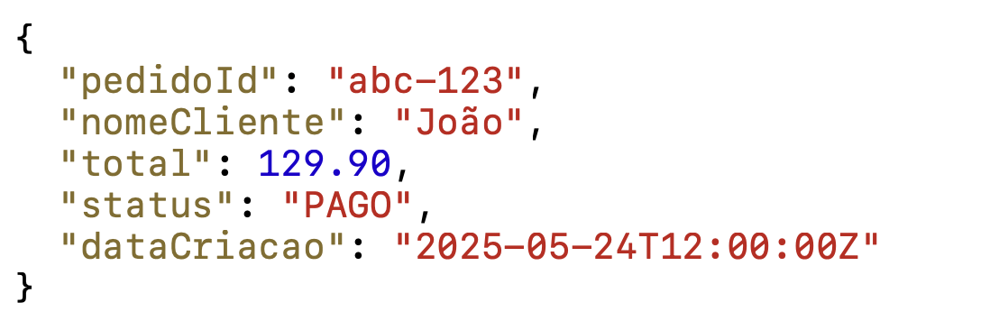

# Capítulo 12: Persistência acompanha o comportamento

Uma das decisões mais comuns em arquitetura é escolher uma estratégia de persistência antes de compreender o comportamento dos dados. ODD inverte essa ordem.

O comportamento das entidades, frequência de mutação, tolerância ao desvio, natureza das leituras e escritas, relação entre consistência e disponibilidade, é o que determina qual estratégia de persistência faz sentido. A tecnologia responde ao comportamento. Não o contrário.

## Transacional e analítico não são a mesma coisa

Existe uma confusão presente em muitas organizações: tratar dados transacionais e dados analíticos como se fossem o mesmo problema, para o mesmo propósito, com as mesmas ferramentas.

O plano transacional está concentrado nas operações imediatas do sistema. Seu objetivo é facilitar a resposta direta e rápida. Quando uma transação precisa acontecer, um pedido precisa ser criado, um grupo precisa ser encerrado, um pagamento precisa ser confirmado, o sistema transacional precisa garantir consistência e completude.

O plano analítico apoia decisões de médio e longo prazo. Taxas de conversão, padrões de comportamento, métricas de produto, essas informações são valiosas para evolução do negócio, mas têm natureza e finalidade diferentes das transações.

Misturar os dois produz complexidade desnecessária. Tentar usar um único pipeline para tudo, com as mesmas garantias e a mesma ferramenta, resulta em sistemas difíceis de operar e difíceis de evoluir.

## Como o comportamento determina a estratégia

Para entidades **voláteis**, como o carrinho, o comportamento exige que a escrita seja rápida e que o estado seja recuperável durante a sessão. Armazenamento em memória com TTL, como Redis, é uma resposta adequada. A persistência transacional pode ser eventual, o que importa é que o estado da sessão esteja disponível enquanto o comprador está ativo.

Para entidades **dinâmicas**, como o grupo de compra ou o pedido, o comportamento exige garantias de consistência transacional. O estado precisa ser correto, e transições de estado precisam ser atômicas, um grupo não pode estar simultaneamente ativo e encerrado. Event Sourcing pode ser uma resposta adequada aqui, porque permite reconstruir o histórico de estados e rastrear a causa de qualquer transição.

Para entidades **semiestáticas**, como o produto, o comportamento permite estratégias de leitura otimizadas. O produto muda raramente, mas é lido com altíssima frequência. Cache distribuído com TTL longo, read models derivados e projeções são respostas adequadas. A consistência eventual entre o modelo de escrita e o modelo de leitura é geralmente aceitável.

Para entidades **massivamente imutáveis**, como ofertas ou promoções publicadas, o comportamento favorece estruturas otimizadas para volume de leitura, Elasticsearch, por exemplo. Uma vez criadas, essas entidades não mudam. Elas são substituídas por novas versões. Isso permite estratégias de cache agressivo e replicação para múltiplos canais sem preocupação com concorrência de escrita.

## Write Model e Read Model

O material de referência apresenta a separação entre modelo de escrita e modelo de leitura como consequência natural dessa análise.

O **Write Model** é o núcleo transacional, entidades ricas em comportamento, com regras de negócio, validações e garantias de consistência (ACID). Ele é o guardião da verdade do domínio.

O **Read Model** é a projeção otimizada para consulta, estruturas desnormalizadas, derivadas do modelo de escrita, eventualmente consistentes. Ele existe para servir leitura com a performance necessária, sem comprometer a integridade do domínio.

*O exemplo mostra um Write Model de pedido: `pedidoId`, `nomeCliente`, `total`, `status: "PAGO"` e `dataCriacao`. Esta é a estrutura transacional — rica em semântica de negócio, com consistência garantida. O Read Model derivado desse pedido seria uma projeção desnormalizada, eventualmente consistente, otimizada para o canal de consulta (dashboard, relatório, busca). Fonte: slide 4 da apresentação "ProdOps — Modelagem de Domínio com Confiabilidade, Parte 2".*

Essa separação não é apenas uma decisão técnica. É uma consequência direta de reconhecer que escrever e ler têm naturezas diferentes, frequências diferentes e requisitos diferentes.

## Group Buying: persistência como decisão de domínio

No Group Buying, se o estoque não puder ser tratado como uma simples informação de catálogo porque ele muda durante o processo de compra e essa mudança precisa ser imediatamente consistente, isso determina como ele deve ser persistido. Não é uma escolha técnica abstrata, é uma resposta ao comportamento descoberto.

Se uma projeção de leitura para exibir grupos ativos em buscas puder tolerar alguns segundos de atraso, isso determina que a indexação pode acontecer de forma assíncrona. Se o encerramento automático de grupos exige que a persistência seja atômica, todos os pedidos registrados ou nenhum, isso determina que o processo precisa de garantias transacionais explícitas.

A pergunta não é qual banco de dados é melhor. É qual comportamento precisa ser preservado, e qual estratégia de persistência responde a esse comportamento com o menor risco operacional.

---

*Persistência é uma consequência do domínio. Quando o comportamento é conhecido, a arquitetura deixa de ser escolha abstrata e passa a ser resposta a uma necessidade concreta.*
