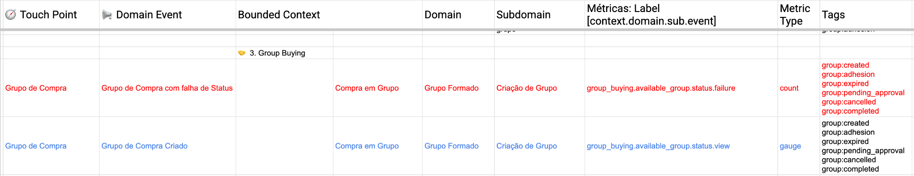

# Capítulo 17 — ODD, PRE e Delivery

ODD não entrega software. Ele entrega condições para decidir.

Essa frase define a fronteira com PRE — e é uma das fronteiras mais importantes de preservar ao longo deste livro.

## A sequência e o que cada etapa faz

A sequência é:

```
Intent → ODD → OBC → PRE → Delivery → Runtime → Outcome
```

**ODD** trabalha para compreender o domínio. Jornada, eventos, protagonistas, fronteiras, contratos, mutabilidade, dependências, Plano de Confiabilidade.

**OBC** consolida esse entendimento em uma representação que habilita o compromisso. Não é documentação — é o ponto de passagem entre descoberta e execução.

**PRE** começa quando existe compromisso e precisa preparar sua execução. Reliability Gates, BDD com extensões de observabilidade, instrumentação, configuração de alertas, Runbooks.

**Delivery** executa o compromisso — o código entra em produção.

**Runtime** confronta o produto com a realidade.

Cada etapa tem uma função distinta. Confundir as funções é perder a razão de existir de cada uma.

## O que PRE não é

PRE não é ODD continuado. Quando PRE começa, o domínio já foi suficientemente compreendido e o compromisso já foi assumido. PRE não está mais descobrindo — está preparando.

Isso tem implicações práticas. Durante PRE, os cenários de confiabilidade são escritos com precisão sobre comportamentos já acordados. O BDD estendido com `Emit / Observe / Expect / Alert` reflete acontecimentos do domínio que foram descobertos durante ODD, não hipóteses sobre o que o domínio pode ser.



*O BDD enriquecido conecta cada ponto de contato a seu Domain Event, Bounded Context, domínio e subdomínio, e em seguida a uma métrica com label semântica no formato `context.domain.sub.event`. No exemplo, "Grupo de Compra com falha de Status" gera a métrica `group_buying.available_group.status.failure` do tipo `count`, com tags para cada estado possível do grupo (created, adhesion, expired, pending\_approval, cancelled, completed). Isso é observabilidade derivada do domínio, não de uma ferramenta. Fonte: slide 77 da apresentação "ProdOps — Modelagem de Domínio com Confiabilidade, Parte 1".*

Se PRE está descobrindo comportamentos fundamentais do domínio, algo no processo anterior não foi concluído. O Plano de Confiabilidade estava incompleto. O OBC não representava suficientemente o domínio. O compromisso foi assumido sobre incerteza não explicitada.

## A causalidade que precisa ser preservada

A causalidade entre as etapas é o que garante que cada uma funcione bem.

Se o domínio não foi compreendido, PRE recebe uma entrada frágil. Os cenários de confiabilidade serão escritos sobre suposições, não sobre comportamentos descobertos. Os alertas serão configurados sobre métricas que podem não refletir o que importa para a jornada.

Se OBC não representa suficientemente o domínio, o compromisso é assumido sobre incerteza não explicitada. O que foi entregue como "compreendido" ainda continha ambiguidades que alguém precisará resolver — provavelmente sob pressão, em produção.

Preservar a causalidade significa que cada etapa entrega o que a próxima precisa. ODD entrega entendimento. OBC entrega habilitação para compromisso. PRE entrega preparação para execução. Delivery entrega o software. Runtime entrega evidência.

## Group Buying: a fronteira na prática

No Group Buying, PRE só pode preparar a execução com segurança depois que a organização entende:

Quais jornadas precisam funcionar — a jornada de criação de grupo, a jornada de adesão, a jornada de encerramento automático, a jornada de entrega.

Quais entidades são protagonistas e quais são seus estados críticos — o grupo com seus estados de ciclo de vida, o pedido com sua integridade financeira, o carrinho com sua volatilidade.

Quais contratos existem e o que eles protegem — a integração com o motor de busca, o processo de encerramento automático, a notificação ao time comercial.

Quais condições de confiabilidade são relevantes — SLOs sobre formação de grupos, alertas sobre pedidos não reconciliados, rastreabilidade do encerramento automático.

Sem esse entendimento, PRE está trabalhando no escuro.

## O que este livro não cobre

Delivery e Runtime pertencem ao livro *From Commitment to Outcome*. O que este capítulo precisa preservar é a fronteira — não antecipar o que vem depois dela.

ODD prepara o conhecimento. OBC prepara a decisão. PRE prepara a execução. A execução em si — como entregar com qualidade, como operar em produção, como evoluir um produto comprometido — é outro livro, com outra responsabilidade.

---

*ODD prepara o conhecimento. OBC prepara a decisão. PRE prepara a execução. Confundir essas funções é perder a própria razão de existir de cada uma.*
